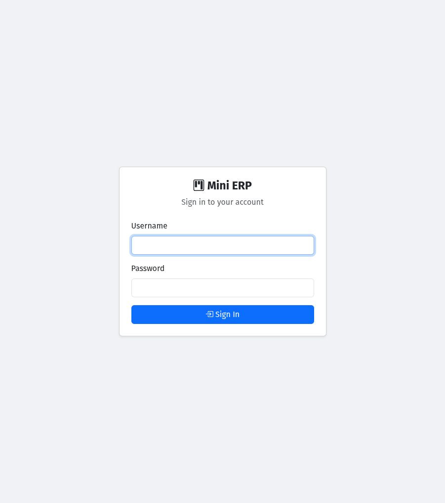
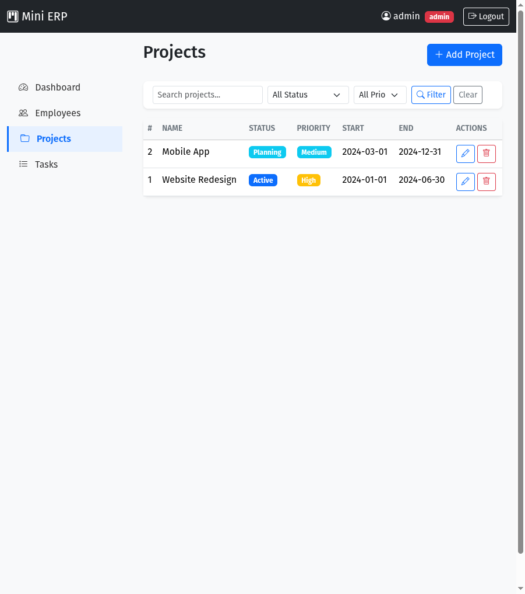
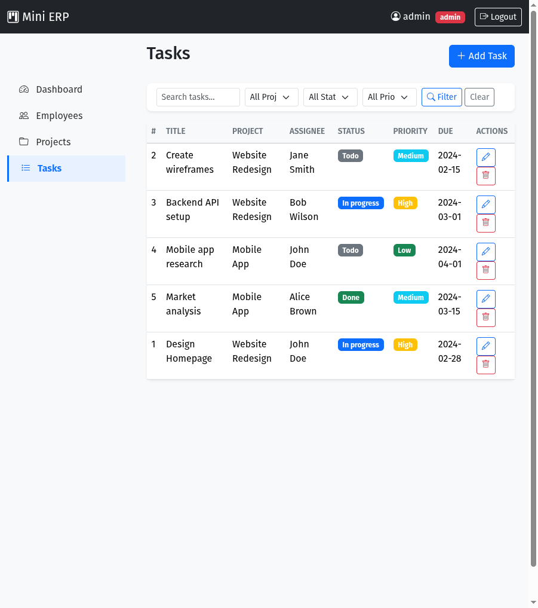

# Mini ERP / Task Management System

**Live Demo:** http://lampp.42web.io

## Tech Stack
- **Linux** (Ubuntu 22.04)
- **Apache** 2.4.52 / PHP Built-in Server
- **MySQL** 8.0
- **PHP** 8.1 (Plain PHP, OOP)
- **HTML/CSS/Bootstrap** 5.3
- **Bootstrap Icons** 1.11

## Features Implemented
- Session-based authentication with login/logout
- Role-based access control (Admin / User)
- Employee Management (CRUD)
- Project Management (CRUD)
- Task Management (CRUD with project/employee linking)
- REST-style API endpoints for all 3 modules (GET, POST, PUT, DELETE)
- Dashboard with stats and recent tasks
- Search and filter on all listing pages
- Pagination component
- Input validation (server-side)
- CSRF protection on all forms
- Password hashing (bcrypt)
- Prepared statements (PDO, real server-side)
- .env configuration
- Activity log table for audit trail
- Security headers (X-Content-Type-Options, X-Frame-Options)

## Setup Instructions

### Prerequisites
- PHP 8.x with extensions: pdo_mysql, mbstring, session
- MySQL 8.0
- Apache (for production) or PHP built-in server (for development)

### Steps
1. Clone the repository
   ```bash
   git clone <repo-url>
   cd lampp
   ```

2. Create the database
   ```bash
   mysql -u root -p < database/schema.sql
   ```

3. Configure environment
   ```bash
   cp src/.env.example src/.env
   # Edit src/.env with your database credentials
   ```

4. Start the development server
   ```bash
   cd src
   php -S localhost:8888 index.php
   ```

5. Open http://localhost:8888 in your browser

### Apache Setup (Production)
Enable `mod_rewrite` and point DocumentRoot to the `src/` directory. The `.htaccess` file handles URL rewriting.

## Test Credentials

| Role  | Username | Password  |
|-------|----------|-----------|
| Admin | admin    | admin123  |
| User  | user     | user123   |

**Admin** can create/edit/delete employees, projects, and tasks.
**User** can view employees/projects and create/edit tasks.

## API Endpoints

All endpoints require session authentication. Prefix: `/api/`

### Employees
| Method | Endpoint | Description |
|--------|----------|-------------|
| GET | `/api/employees` | List (paginated, filterable) |
| GET | `/api/employees?id={id}` | Get single |
| POST | `/api/employees` | Create |
| PUT | `/api/employees?id={id}` | Update |
| DELETE | `/api/employees?id={id}` | Delete |

### Projects
| Method | Endpoint | Description |
|--------|----------|-------------|
| GET | `/api/projects` | List (paginated, filterable) |
| GET | `/api/projects?id={id}` | Get single |
| POST | `/api/projects` | Create |
| PUT | `/api/projects?id={id}` | Update |
| DELETE | `/api/projects?id={id}` | Delete |

### Tasks
| Method | Endpoint | Description |
|--------|----------|-------------|
| GET | `/api/tasks` | List (paginated, filterable) |
| GET | `/api/tasks?id={id}` | Get single |
| POST | `/api/tasks` | Create |
| PUT | `/api/tasks?id={id}` | Update |
| DELETE | `/api/tasks?id={id}` | Delete |

**Filters** (query params): `search`, `status`, `priority`, `page`, `department` (employees), `project_id` (tasks)

## Known Limitations
- API uses session cookies for auth (no token-based auth)
- No file upload functionality
- No email notifications
- No password reset feature
- Single-user session (no concurrent session tracking)

## Screenshots

### Login


### Dashboard


### Employees


### Projects


### Tasks

